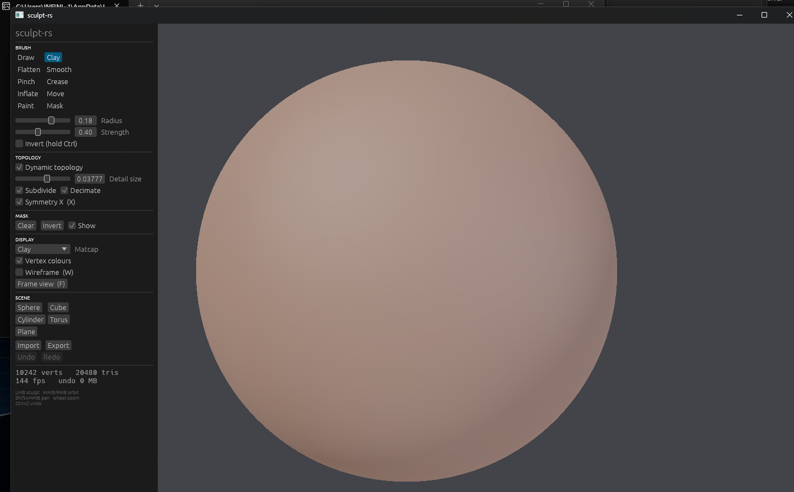

# sculpt-rs

A real-time 3D sculpting tool written from scratch in Rust, with dynamic
topology. Native desktop, rendered on the GPU through wgpu, with an interface
built for a pen and a touch screen as much as for a mouse.



## What it does

**Sculpting**

- **Dynamic topology.** Detail is created and removed under the brush by
  splitting and collapsing edges, so you sculpt without worrying about the
  starting resolution. Subdivision and decimation can be toggled separately,
  and a vertex ceiling keeps a runaway stroke from eating the machine.
- **Sixteen brushes.** Draw, Clay, Flatten, Smooth, Pinch, Crease, Inflate,
  Move, Drag, Twist, Scale, Paint, Smudge, Blur, Fill and Mask. Each one
  remembers its own radius, strength and options, so switching tools never
  loses your settings.
- **Five falloff curves** per brush, previewed as a live graph: Smooth,
  Linear, Sharp, Sphere and Constant.
- **Alphas.** A falloff can only make a circle. An alpha multiplies it by an
  image stamped across the dab, which is what turns one brush into cracks,
  scales, a hatch or a photographed grain. Six are generated in code so the
  brush is useful with no files at all, and any image can be loaded on top.
  The stamp holds the angle it has on screen, or turns to follow the stroke.
- **Named brushes.** Keep a tool at a particular size, falloff, alpha and
  colour under a name, and save the set to a plain-text file that carries
  between sessions.
- **Brush behaviour**: front-face culling, a locked stroke plane for carving
  straight ridges, auto smoothing folded into the stroke, and pen pressure
  mapped to radius, strength or both.
- **Symmetry** across any axis, with the mirrored dab computed in the same
  pass as the original.
- **Masking** with blur, sharpen, invert and clear, plus extraction of the
  masked region into a separate solid object.

**Painting**

- Paint colour, roughness and metalness per vertex, through nine blend modes:
  Normal, Multiply, Screen, Add, Subtract, Overlay, Darken, Lighten and Hue.
- Smudge, blur and sharpen colour, and flood-fill a face, a whole flat region
  or an entire object.
- A colour panel with a saturation and value square, a hue strip, an
  eyedropper, a greys-only mode for value studies, a palette, and the schemes
  worth having on screen while you work: opposite, near, triad, split and
  shades of the same hue.

**Topology and repair**

- **Uniform subdivision**, plain midpoint or the Loop scheme.
- **Decimation** to a target fraction of the triangle count, guarded so the
  mesh stays a valid manifold.
- **Voxel remeshing** through a signed distance field and surface nets, which
  rebuilds a clean uniform shell out of whatever mess a long session produced.
- **Hole filling** on every boundary loop.
- **Mirror** and **symmetrize**, the latter clipping the triangles that
  straddle the plane and welding the seam.

**Scene**

- Several objects, each with its own placement, visibility and history.
- Select by clicking in the viewport, duplicate, delete, merge everything
  visible, bake a placement into the vertices.
- Undo and redo across geometry, placement and structural edits, bounded by a
  memory budget.

**Display**

- Six shading modes: matcap, a lit PBR view that reads the painted roughness
  and metalness, world normals, cavity, unlit for hand-painting, and
  untextured clay for judging form.
- A tone curve on the lit view, with exposure in stops, contrast and
  saturation, so a highlight rolls off instead of clipping to a white disc.
  The other views are colours somebody already chose, and are left alone.
- Matcaps three ways: five generated presets, an editable lightcap where the
  material and all three lights can be taken apart and aimed by dragging, or
  an image loaded off disk.
- Flat shading, wireframe, adjustable opacity, vertex colours.
- An infinite ground grid with tinted world axes, a gradient background you
  can recolour, and multisampling up to 8x.
- Perspective or orthographic camera with named views, adjustable field of
  view, orbit speed and smoothing.

**Files**

- Import and export OBJ (with vertex colours), PLY (binary and ASCII) and STL
  (binary and ASCII).
- A native `.sculpt` scene file that keeps every object, its placement and
  every per-vertex attribute.
- A plain-text `.brushes` file for a set of named brushes.
- PNG, JPEG, BMP and TGA in, as brush alphas and as matcaps.

## Architecture

The vocabulary below is set out in full in [docs/NAMES.md](docs/NAMES.md): every
part of the engine has a name of ours, and a note on the published work it rests
on.

Two crates:

- `sculpt-core` is the engine. No graphics dependency, so it runs in headless
  tests and could later be compiled to WebAssembly unchanged. It owns the
  scene, the mesh, the ring of faces around each vertex, the grid, live
  topology, brushes, topology commands, the undo log and file I/O.
- `sculpt-app` is the desktop shell: wgpu renderer, winit window, egui
  interface, orbit camera, and pointer, pen and touch handling.

The mesh keeps its vertex and index arrays gap-free so they upload to the GPU
without a compaction pass. Removal uses `swap_remove` plus an index fixup for
the element that moved into the hole.

Sculpting is local but a naive query is not: every dab would otherwise scan the
whole model. The grid is an incremental spatial hash over vertices and faces,
sized so a sphere query always walks a constant number of cells whatever the
zoom level. Every mesh mutation that goes through the safe API keeps it in sync;
anything that rewrites the arrays wholesale drops it, and the next query
rebuilds. It is filled across every core, and never rebuilt in the middle of a
stroke: a rebuild between two dabs is a freeze with the pen down, where cells
that no longer match the radius only cost a wider walk. Ray casts walk the same
grid front to back and stop as soon as the nearest hit is certain.

A stroke is remembered as the slots it wrote over and the lengths the arrays
started at, which is enough to rebuild them exactly and holds whether or not the
stroke cut the topology. The faces are grouped into packets, contiguous runs
carrying a box and a normal cone, so the view can throw away what it cannot see
before anything is drawn. Brushes and the heavier commands run in parallel over
rayon.

A vertex is twelve floats in the engine and twenty-four bytes on the card, in
two streams. The hot one holds the position at full precision and the normal
folded onto an octahedron as two sixteen-bit numbers; the cold one holds the
colour, mask, roughness and metalness at a byte each. Shading a pixel reads only
the first, a sculpt stroke writes only the first, and a paint stroke only the
second.

The renderer draws every object from one uniform buffer addressed with dynamic
offsets, so a scene costs one bind group rebind per object and no buffer writes
inside the render pass. The background, the model and the ground grid are three
pipelines sharing one set of globals; the grid is a fullscreen triangle
intersected with the ground plane in the fragment shader, which gives an
infinite grid with correct depth and nothing to tessellate.

## Interface

The interface is built around three fixed places: the tool you are holding is
always on the left rail, its settings are always in the same panel on the right,
and the actions you reach for constantly sit in the top bar. Nothing is buried
in a menu. Any panel can be torn out of the dock into a window that floats over
the model, and closing that window puts it back.

Holding a key summons a radial menu at the cursor: the tools around the outside,
a pad in the middle you drag up and down for size and across for force. On a
painting tool it becomes a painting menu, with the blend modes around the tools
and the hue wrapped right around the outside of the disc.

Three floating buttons sit over the viewport for size, the menu and force, two
more for pan and zoom, and an orientation ball you can click to snap to a named
view or drag to spin the model. All of them can be moved, resized or hidden.

Every control is drawn for a fingertip. The icons are vector shapes painted in
code rather than an icon font, so they stay crisp at any size and the binary
ships no assets. Sliders are full-width rails you can grab anywhere, with the
label and the value printed inside so a finger never covers the number it is
setting. One switch in the View tab grows every target for a touch screen, and
an interface scale slider takes it further.

## Build and run

Needs a recent stable Rust toolchain.

```bash
cargo run --release -p sculpt-app
```

## Controls

| Input | Action |
|-------|--------|
| Left mouse, one finger, pen | Sculpt on the model, spin the view off it |
| Middle or right mouse | Orbit |
| Two fingers | Orbit, pinch to zoom, drag together to pan |
| Three fingers | Pan |
| Shift + middle mouse | Pan |
| Wheel | Zoom |
| Alt + left mouse | Orbit without sculpting |
| Ctrl (hold) | Invert the brush |
| Shift (hold) | Smooth instead of sculpting |
| `1` to `0`, Shift+`1`..`3` | Pick a tool |
| `[` / `]` | Brush radius |
| `-` / `=` | Brush strength |
| `X` / `W` / `G` | Symmetry, wireframe, grid |
| `F` | Frame the model |
| `Tab` | Show or hide the panel |
| `H` | Shortcuts |
| Numpad `1` / `3` / `7` | Front, right and top views |
| Numpad `5` | Perspective or orthographic |
| Ctrl+Z / Ctrl+Shift+Z | Undo and redo |
| Double tap, two or three fingers | Undo and redo |
| Space (hold) | Radial menu |

A second finger landing mid-stroke cancels the stroke rather than smearing the
model while the view swings around.

Every device can be bound to something else in the Interface tab. The default
for the pointer, the finger and the pen is the automatic one: a press that lands
on the model draws, a press that lands off it spins the view, and the answer is
settled at the moment of contact so a stroke that wanders off the silhouette
keeps drawing.

## Tests

```bash
cargo test
```

The engine tests check the invariants directly: adjacency stays consistent
through edge split and collapse, the icosphere satisfies the Euler
characteristic of a sphere, dynamic topology refines without corrupting the
mesh or the spatial index, the grid returns exactly what a brute-force scan
returns, undo restores the previous state, a symmetric stroke moves both sides
by the same amount, subdivision quadruples the face count, decimation reduces
it while staying valid, a voxel remesh comes back watertight, hole filling
seals an open plane, an alpha shapes the dab it is stamped through, and OBJ,
PLY, scene and brush round trips preserve what went into them.

Tests stop at the edge of the card, and a mistake in a vertex layout only shows
at run time. So there is one more check that does not:

```bash
cargo run --release -p sculpt-app --example offscreen
```

It builds the real pipelines with no window, draws a sphere, reads the pixels
back and looks at them: the centre must carry the normal that faces the camera,
which is the octahedral encoding checked end to end, and a stroke and a painted
colour sent through the sparse update must both arrive.

## Where this is going

[docs/ROADMAP.md](docs/ROADMAP.md) sets what is here against what a finished
sculpting application contains, item by item, with what each missing piece rests
on and how we will know it works. It puts the rest in the order it is worth
doing, and carries the performance numbers with the commands to reproduce them.

[docs/NAMES.md](docs/NAMES.md) is the vocabulary: what every part of the engine
is called here, and the published work behind it.

## Notes on origin

This is a clean-room implementation. It reuses well known, published techniques
(edge split and collapse for dynamic topology, Loop subdivision, surface nets
over a signed distance field, a normal-indexed matcap, the Wyvill falloff
kernel, Moller-Trumbore ray casting, spatial hashing) but no third-party
application code.

## License

MIT. See [LICENSE](LICENSE).
