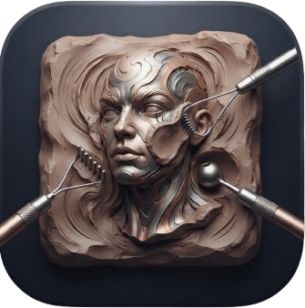

<p align="center">
  
</p>

# sculpt-rs

A real-time 3D sculpting tool written in Rust, with dynamic topology and a
GPU renderer. Built for a pen and a touch screen as much as for a mouse.


## What it does

- **Dynamic topology.** Detail appears and disappears under the brush by
  splitting and collapsing edges, so the starting resolution does not matter.
- **Sixteen brushes.** Draw, Clay, Flatten, Smooth, Pinch, Crease, Inflate,
  Move, Drag, Twist, Scale, Paint, Smudge, Blur, Fill and Mask, each keeping
  its own radius, strength and options.
- **Falloffs and alphas.** Five falloff curves, procedurally generated alphas,
  and any image you load.
- **Symmetry, masking and painting.** Mirror across any axis, a protection
  mask with blur and sharpen, and painted colour, roughness and metalness.
- **Voxel sculpting.** A voxel field behind the brush makes the cost of a
  stroke independent of the polygon count. Toggle with `V`.
- **Files.** OBJ, PLY and STL in and out, and a compressed scene format with
  per-channel blocks.
- **The interface.** Docked panels that tear out, a radial menu, and gesture
  support for pen, touch and mouse.

## Build

```
cargo run --release
```

Requires a GPU with Vulkan, Metal, Direct3D 12 or WebGPU support (wgpu picks
the best available).

## Controls

- Left mouse or pen: sculpt
- Right mouse or pen button: navigate the camera
- Middle mouse: pan
- `V`: toggle voxel sculpting
- `F`: frame the model
- `X`: toggle symmetry
- `W`: toggle wireframe
- `G`: toggle the grid
- `[` and `]`: brush radius
- `-` and `=`: brush strength

## License

MIT.
